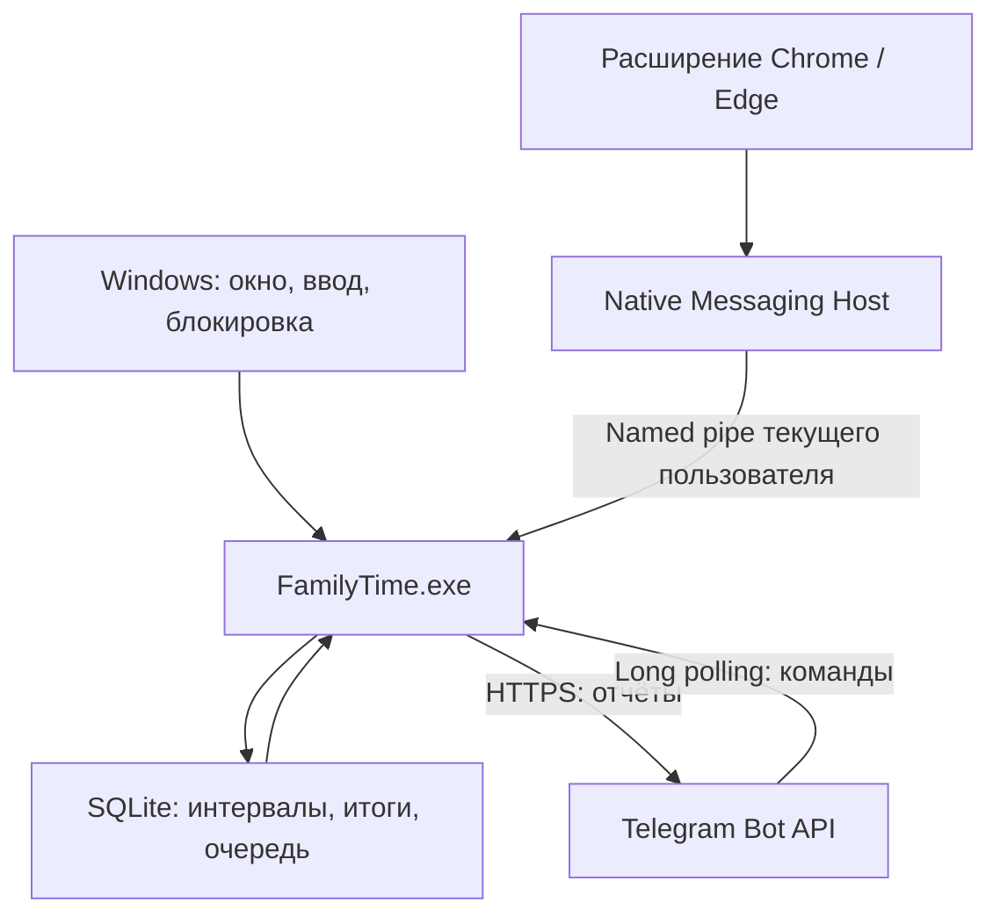

# Архитектура 0.1.0

## Компоненты

| Каталог | Ответственность |
|---|---|
| `FamilyTime.Core` | Интервалы, правила лимита, SQLite, отчёты, проверка Telegram-команд и очередь |
| `FamilyTime.Windows` | WPF-интерфейс, foreground/idle/XInput, события Windows, DPAPI, фоновые циклы и tray |
| `FamilyTime.NativeHost` | Ограниченные JSON-кадры между браузером и локальным named pipe |
| `extension` | Manifest V3, активный домен, сигнал YouTube, состояние подключения |
| `tests` | Исполняемый набор проверок ядра без стороннего тестового фреймворка |
| `packaging` | Сборка и установщик NSIS для текущего пользователя |

Это пользовательское приложение, а не Windows-служба. Ему нужен интерактивный рабочий стол текущего пользователя. Одновременные пользовательские сессии и сбор с нескольких компьютеров не объединяются.

## Поток наблюдений

Опрос примерно раз в секунду берёт процесс активного окна, время последнего ввода и XInput. События lock/suspend/unlock/resume задают границы. Название берётся из процесса/описания файла, заголовок окна не читается. Движок относит прошедший интервал к предыдущему наблюдению; длительная задержка или разница с монотонными часами превращает его в неизвестный интервал.

При простое интервал разделяется по точной границе `lastInput + idleThreshold`. Подтверждённое видео в активной вкладке снимает idle только для этой вкладки, пока её браузер на переднем плане. Вторая линия интервалов хранит факт любого фонового YouTube; она не участвует в основном итоге. Несколько фоновых плееров не суммируются друг с другом.

Расширение передаёт состояние каждые ~2 секунды и при переключениях. Событие устаревает через 7 секунд. Для YouTube проверяется изменение позиции плеера; перемотка и пауза не считаются просмотром. Это признак воспроизведения, а не доказательство внимания человека. Если фоновые таймеры браузера замедлены, сведения о фоне могут теряться.

SQLite обновляет интервалы и дневные агрегаты в одной транзакции. Совпадающие соседние интервалы объединяются; граница локального дня остаётся отдельной. Основные сохранённые интервалы не пересекаются: повторное наблюдение и откат системных часов не должны повторно добавить тот же участок. После отката часть времени может остаться недоучтённой до возвращения времени к сохранённой границе. Это не защита от администратора ПК.

## Данные и доставка

SQLite работает в WAL, synchronous FULL. Основные таблицы: `segments`, `daily`, `meta`, `limit_history`, `alerts`, `inbox`, `outbox`. Родительская привязка требует одноразовую случайную ссылку с 96-битным кодом; в базе остаётся только SHA-256 кода и срок 10 минут. Доступ к отчётам проверяет private chat, числовые chat_id и user_id вместе.

Принятая команда и исходящий ответ фиксируются одной транзакцией. Подтверждённый Telegram message_id сохраняется. Переходы исходящего сообщения: pending → sent или error; временная ошибка оставляет pending с отложенным повтором. Ключи дневного порога включают дату, редакцию лимита и тип события. Повторное событие не создаёт новую локальную попытку и сообщение.

Транспорт не может гарантировать exactly-once: при потере ответа после успешной доставки возможен повтор. В текст добавляется стабильный номер события. Отмена подключения отменяет ожидающие сообщения старой привязки; уже отправленный запрос внешнему API отозвать нельзя.

Программа общается только с Telegram по исходящему HTTPS. Native Messaging разрешён одному ID расширения; named pipe доступен текущему Windows-пользователю, длина кадра ограничена 8192 байтами. Это ограничение поверхности взаимодействия, а не защита от другой программы в той же учётной записи.

## Установка и распространение

Установщик устанавливает self-contained app и native host с общей .NET-средой. Реестр браузера и автозапуска — HKCU. Настройки автозапуска включаются после первого сохранения. Расширение ставится явно пользователем в режиме разработчика. Обновление выполняет обычное завершение приложения; удаление перечисляет только поставленные файлы. Данные находятся за пределами каталога программы.

UI построен на WPF. Для локального баннера используется штатный NotifyIcon Windows, а на экране всегда остаётся остаток/превышение. Факт вызова баннера хранится как attempted, не как подтверждение прочтения.
